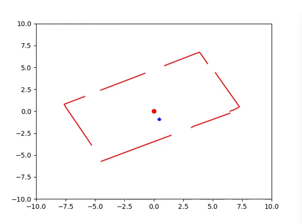

# Lidar_pkg
Este conjunto de paquetes de catkin ayudan a simular en Gazebo el chasis de un robot tipo Rover y un sensor Lidar. Además, permiten subscribirse al tópico del Lidar y visualizar los objetos circundantes al sensor en un plot. 


De manera general los 4 paquetes contienen lo siguiente.
- lidar_control: definición de los controladores PID, perspectiva RQT y launch de los controladores
- lidar_description: meshes .dae y archivos URDF
- lidar_gazebo: gazebo world y gazebo launch
- lidar_src: scripts de python para publicar o subscribirse a los nodos

Para el correcto funcionamiento del paquete asegurese de tener instalados los paquetes y dependencias como indica el siguiente link http://gazebosim.org/tutorials?tut=ros_installing&cat=connect_ros

Una vez que tenga el paquete ejecute el comando `roslaunch lidar_gazebo lidar_world.launch` en la consola, la gui de Gazebo está desactivada por defecto así que no verá nada además de los mensajes de consola. En caso de quererla activar cambie a true el parametro del argumento gui <arg name="gui" default="true"/> en el archivo lidar_world.launch

En otra cosola ejecute el comando ```rosrun gazebo_ros spawn_model -file `echo $GAZEBO_MODEL_PATH`/home/berenice/catkin_ws/src/lidar_pkg/lidar_gazebo/worlds/Cuarto/model.sdf -sdf -model Cuarto -y 1.0 -x -5.0``` el cual posicionará unas paredes alrededor del modelo como lo muestra la imagen siguiente.


Posteriormente en la consola ejecute `rosrun lidar_src lidarRanges.py` o bien desde la carpeta scripts use `python3 lidarRanges.py`. Verá algo como lo que muestra la imagen siguiente.


Finalmente mueva el joint1 del modelo ejecutando `rosrun lidar_src main.py` o `python3 main.py`, en la consola se deplegarán los datos que están siendo publicados en el tópico y por lo tanto provocan el movimiento del joint.


 Por otro lado, verá como la figura del plot comienza a moverse.
 

